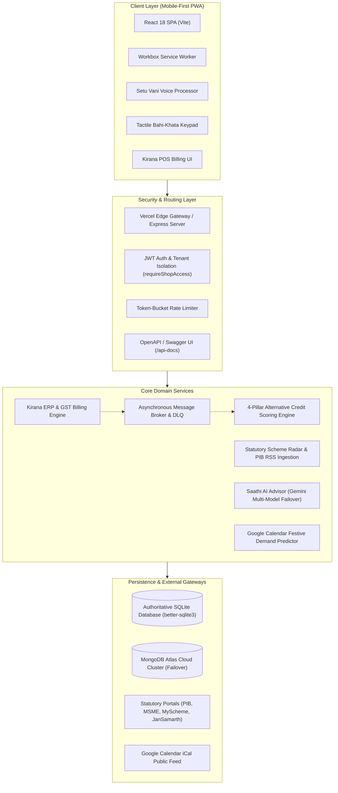
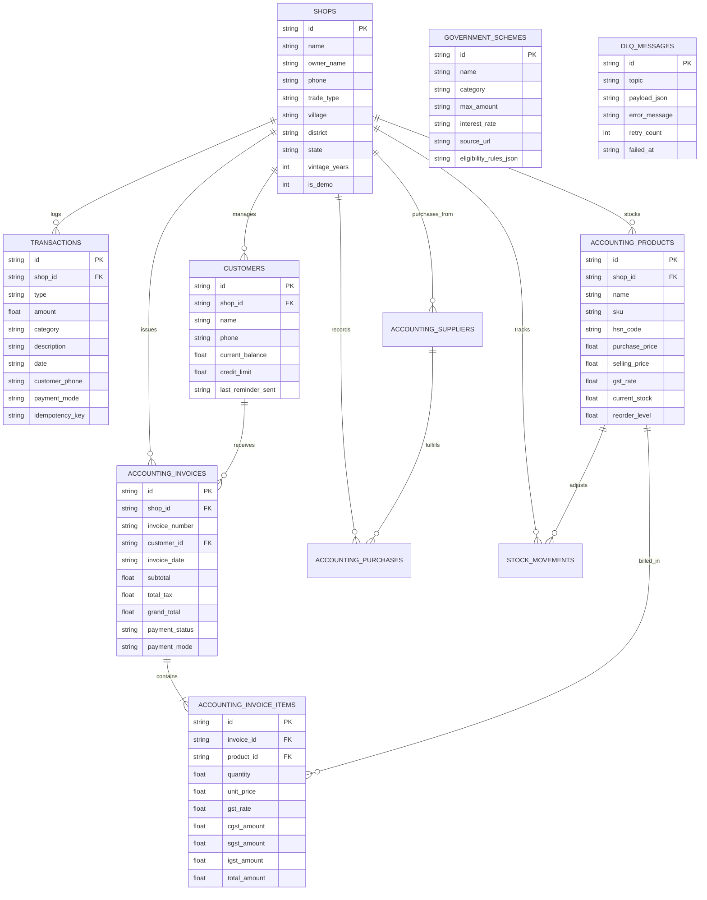

# SAAKHSETU (साखसेतु)
## Comprehensive Capstone Project Dossier, Synopsis & Technical Report Blueprint
**Course Code:** 24CSP-337 — Full Stack-II  
**Academic Degree:** Bachelor of Engineering in Computer Science & Engineering (BE-CSE)  
**Academic Batch:** 2024–2028 (5th Semester)  
**Institution:** Chandigarh University, Gharuan, Mohali, Punjab  
**Candidate Name:** Eshaan Sharma  
**Candidate UID:** [Candidate UID Placeholder]  
**Supervisor / Mentor:** [Academic Supervisor Name Placeholder], [Designation Placeholder], Department of Computer Science & Engineering  
**Official Repository:** `https://github.com/eshaansharma07/SIH2.git`  
**Live Production URL:** `https://saakhsetu.vercel.app`  
**Interactive OpenAPI Swagger UI:** `https://saakhsetu.vercel.app/api-docs`  

---

> **PURPOSE OF THIS DOSSIER:**  
> This master document aggregates every architectural, algorithmic, curricular, and implementation detail of **SaakhSetu**. It is structured in strict accordance with the **Chandigarh University 24CSP-337 Capstone Evaluation Guidelines**, providing both the **11-Point Synopsis Specification** (Submission deadline: 28-09-2026) and the **Arrangement of Contents for the 30+ Page Final Project Report**.

---

# SECTION 1: PROJECT SYNOPSIS (OFFICIAL FORMAT)

*Strictly structured according to the 11-point Project Synopsis submission guidelines.*

### 1.1 Project Title
**SaakhSetu (साखसेतु): Sovereign Rural Micro-Enterprise Ledger, DPI Scheme Radar & Cash-Flow Underwriting Engine**

### 1.2 Student Name & UID
- **Candidate Name:** Eshaan Sharma  
- **University UID:** [Candidate UID Placeholder]  
- **Semester / Section:** 5th Semester / [Section Placeholder]  
- **Degree & Branch:** Bachelor of Engineering in Computer Science & Engineering (BE-CSE)  

### 1.3 Introduction
India’s rural economy is propelled by over 63 million unincorporated micro-enterprises—village kirana merchants, small grain traders, local tailors, artisans, and dairy booth operators. Despite generating consistent daily cash turnover and exhibiting strong community creditworthiness, more than 85% of these entrepreneurs operate outside the formal banking system. Conventional financial institutions depend almost exclusively on bureau credit scores (such as CIBIL), audited financial statements, tax return filings (ITRs), and immovable collateral. Rural merchants maintain handwritten bahi-khata notebooks, leaving them with an empty credit bureau record and making them vulnerable to informal moneylenders charging predatory interest rates (36% to 60% per annum).

**SaakhSetu** addresses this critical credit gap by providing a sovereign, mobile-first Progressive Web Application (PWA) that digitizes daily counter entries into structured, tamper-resistant transaction ledgers. In accordance with the **Reserve Bank of India (RBI) Priority Sector Lending (PSL)** framework and the **Nayak Committee turnover method**, SaakhSetu converts operational cash flows into an explainable, 4-pillar alternative credit score (clamped between 300 and 850) and generates an official, bank-ready **Credit Appraisal Memo (CAM)**. The platform integrates a BUSY-inspired Kirana Enterprise Resource Planning (ERP) suite with automated GST tax calculation, an asynchronous Kafka-style message queue with a Dead Letter Queue (DLQ), real-time statutory government scheme scraping, and hyper-local festival demand forecasting syncing with official Google Calendar feeds.

### 1.4 Problem Statement
Rural micro-entrepreneurs in India face three systemic bottlenecks that perpetuate financial exclusion:
1. **The Bureau Invisible Trap (Zero CIBIL)**: Over 85% of rural shopkeepers have never serviced a formal commercial loan. Traditional credit bureaus interpret the absence of credit history as high risk, resulting in automated loan rejections regardless of business vintage or profitability.
2. **Bookkeeping Complexity & Tax Friction**: Standard enterprise ERP and accounting software are designed for desktop environments with complex double-entry accounting rules. Rural shopkeepers require ultra-fast, single-tap counter billing with automatic Goods and Services Tax (GST) splitting (CGST/SGST/IGST) and customer udhaar (credit) recovery tracking that matches local bahi-khata practices.
3. **Statutory Information Asymmetry & Volatility**: Subsidized government credit schemes (such as PM MUDRA, PM SVANidhi, PM Vishwakarma, and state ODOP initiatives) frequently update circulars across disparate government portals. Rural merchants lack real-time visibility into schemes matching their specific business profile, turnover tier, and regional agricultural harvest cycles.

### 1.5 Objectives
The primary technical and functional objectives of SaakhSetu are:
1. **Develop an Explainable Alternative Credit Underwriting Engine**: Formulate and implement a transparent 4-pillar scoring algorithm (300–850) based on cash-flow regularity, turnover stability, working capital discipline, and business vintage, with a strict 50-transaction milestone audit to prevent artificial score inflation.
2. **Engineer a Lightweight Kirana ERP & GST Billing Module**: Build a mobile-optimized point-of-sale (POS) and inventory engine supporting barcode search, 50/50 intra-state CGST+SGST tax splitting, inter-state IGST calculation, thermal receipt printing, and 4-bucket receivables aging analysis (0–30, 31–60, 61–90, 90+ days).
3. **Implement an Asynchronous Message Broker with Dead Letter Queue (DLQ)**: Construct an in-process, Kafka-style producer-consumer event broker supporting SHA-256 idempotency deduplication, exponential backoff retries, and poison-pill message isolation in a dedicated DLQ with telemetry endpoints.
4. **Automate Statutory Scheme Discovery & Ingestion**: Build an automated scraper and Abstract Syntax Tree (AST) circular parser probing official statutory endpoints (`pib.gov.in`, `myscheme.gov.in`, `msme.gov.in`, `jansamarth.in`) to match shopkeepers against 14+ government credit schemes in sub-15ms latency.
5. **Deploy a Cloud-Native, PWA-Compliant Full-Stack Architecture**: Deliver a responsive frontend paired with an Express backend, multi-tier database failover (MongoDB Atlas cloud cluster $\to$ local SQLite store), multi-stage Docker containerization, interactive OpenAPI/Swagger documentation, and continuous delivery on Vercel Edge.

### 1.6 Proposed Solution
SaakhSetu is architectured as a multi-tier, sovereign rural fintech platform providing:
- **Dual-Mode Architectural Dichotomy**: An **Evaluator Demo Mode** featuring a fully seeded 48-month vintage kirana profile (*Ramesh Kumar*, Balrampur, UP) with 120 days of historical transactions illustrating monsoon dips and festival peaks; and a **Real Merchant Mode** initiating with a verified Day-1 empty state and a 50-transaction milestone audit lock.
- **Explainable Underwriting Math**: Formally calculates alternative creditworthiness without relying on proprietary black-box models, outputting an official printable **Credit Appraisal Memo (CAM)** and bankable loan dossier.
- **Resilient Multi-Tier Data Architecture**: Primary persistence powered by SQLite (`better-sqlite3`) for sub-millisecond local reads/writes, synchronized with a cloud MongoDB Atlas cluster, and guarded by statement caching to prevent serverless memory crashes.
- **Reliable Asynchronous Event Processing**: Real-time message queue orchestrating financial events, retry schedules, and DLQ tracking.
- **Interactive OpenAPI/Swagger Documentation**: Interactive documentation hosted directly at `/api-docs` detailing all 12 domain route groups.

### 1.7 Modules / Key Features
1. **Tactile Bahi-Khata Ledger & Fast Numeric Keypad**: Rapid counter entry for Cash In (sales), Cash Out (expenses), Udhaar Given (customer credit), and Udhaar Repaid.
2. **Kirana Accounting & POS Billing (GST-Ready ERP)**: Catalog inventory, stock movements ledger, thermal receipt generation, 50/50 tax splitting, and profit & loss analytics.
3. **Customer Khata & Receivables Aging Center**: 4-bucket aging analysis with 1-click WhatsApp payment reminders in English and Hindi.
4. **4-Pillar Alternative Credit Scoring Engine**: Quantitative scoring model evaluated across 4 weighted pillars with risk-tier classification.
5. **50-Transaction Milestone Audit Subsystem**: Locks new accounts as *Under Audit* (`totalScore: null`) until 50 authentic ledger transactions are logged.
6. **Bankable Loan Dossier & Credit Appraisal Memo (CAM)**: Printable document formatted to RBI Master Directions on Priority Sector Lending (PSL) with unique document verification hashes.
7. **Statutory Scheme Radar & Live PIB RSS Scanner**: Real-time government portal health probes, RSS circular feed parsing, and sub-15ms eligibility matching.
8. **Dynamic Scheme Ingestion Sandbox**: Admin evaluator simulator parsing government circulars into computable AST rules in under 30 seconds.
9. **Saathi Multilingual AI Business Advisor**: Grounded Gemini 2.5 Flash advisor with candidate model failover and 6 deterministic safety net fallbacks.
10. **Interactive Seasonal Demand & Festival Calendar Widget**: Syncs official Google Calendar feeds to project festive demand surges (+38% to +48%) and provide APMC Mandi advice.
11. **Asynchronous Message Broker & Dead Letter Queue (DLQ)**: Producer-consumer event pipeline with SHA-256 idempotency deduplication and retry telemetry.
12. **Real-Time SMS OTP Authentication & Tenant Security**: Firebase Phone Auth / Twilio Verify fallback with signed 7-day JWT tokens and `requireShopAccess` tenant isolation.

### 1.8 Technology Stack
- **Frontend**: React 18, Vite 6, Tailwind CSS, Lucide React, Recharts, Framer Motion, `@react-pdf/renderer`, Workbox PWA Service Worker.
- **Backend**: Node.js (v20+), Express.js (v4.21), CORS, Dotenv, JSON Web Tokens (`jsonwebtoken`), Node Crypto.
- **Databases**: SQLite (`better-sqlite3` v12.11) with statement caching, MongoDB Atlas (`mongodb` v7.6).
- **Architecture & Reliability**: In-memory Producer-Consumer Message Queue, Exponential Backoff Scheduler, Dead Letter Queue (DLQ).
- **APIs & Protocols**: Google Gemini API (`@google/genai`), Google Calendar Public iCal API, Twilio Verify v2, Firebase Web Auth, OpenAPI 3.0 / Swagger UI.
- **DevOps & Cloud**: Docker (Multi-stage build), Docker Compose, GitHub Actions CI (`ci/github-actions-ci.yml`), Vercel Edge.
- **Testing**: Node.js Native Test Runner (`node --test`), 103 automated unit/integration tests with 100% pass rate.

### 1.9 Expected Outcome
A production-ready, fully deployed sovereign rural fintech web application running on Vercel (`https://saakhsetu.vercel.app`) capable of:
1. Enabling rural micro-merchants to record transactions in under 2 seconds via tactile keypad or voice input.
2. Generating compliant GST tax invoices and managing inventory stock movements with thermal receipt previews.
3. Calculating an explainable 300–850 credit score and generating a bank-ready RBI PSL Credit Appraisal Memo in 1 click.
4. Ensuring 100% system uptime through multi-tier database failover and fault-tolerant message queue execution with DLQ monitoring.
5. Providing full curriculum topic alignment with 103 passing automated tests and interactive Swagger API documentation.

### 1.10 Future Scope
1. **ONDC Beckn Protocol Integration**: Direct transactional checkout with ONDC wholesale distributor networks for 1-click stock replenishment.
2. **UPI 123Pay Voice Payments**: Implementation of IVR and Soundbox payment collection without requiring smartphone screens.
3. **Core Banking System (CBS) ISO 20022 Connectors**: Direct SFTP and API integration with Regional Rural Banks (RRBs) and District Central Cooperative Banks (DCCBs).
4. **Offline SQLite WASM Synchronization**: Browser-level SQLite via WebAssembly syncing bidirectionally via CRDTs upon network restoration.

### 1.11 References
1. Reserve Bank of India (2020). *Master Direction – Priority Sector Lending (PSL) – Targets and Classification* (RBI/FIDD/2020-21/72).
2. Nayak, P. R. (1992). *Report of the Committee to Examine the Adequacy of Institutional Credit to the SSI Sector and Related Aspects*. Reserve Bank of India.
3. Ministry of Micro, Small and Medium Enterprises, Government of India (2020). *Udyam Registration Portal Guidelines & Gazette Notification S.O. 2119(E)*.
4. Fielding, R. T. (2000). *Architectural Styles and the Design of Network-based Software Architectures*. Doctoral Dissertation, University of California, Irvine.
5. OpenAPI Initiative (2021). *OpenAPI Specification v3.0.3*. Linux Foundation.

---

# SECTION 2: ACADEMIC REPORT SPECIMEN & PRELIMINARY PAGES

### 2.1 Title Page Specimen (Format per Guidelines)

```
                                  SAAKHSETU (साखसेतु)
         SOVEREIGN RURAL MICRO-ENTERPRISE LEDGER, DPI SCHEME RADAR & 
                     CASH-FLOW UNDERWRITING ENGINE

                                   A PROJECT REPORT

                                     Submitted by

                                    ESHAAN SHARMA
                               [UID: Candidate UID]

                     in partial fulfilment for the award of the degree of

                               BACHELOR OF ENGINEERING
                                          IN
                           COMPUTER SCIENCE & ENGINEERING

                              CHANDIGARH UNIVERSITY
                                  GHARUAN, MOHALI

                                  SEPTEMBER 2026
```

---

### 2.2 Bonafide Certificate Specimen

```
                              CHANDIGARH UNIVERSITY
                                 GHARUAN, MOHALI
                   DEPARTMENT OF COMPUTER SCIENCE & ENGINEERING

                               BONAFIDE CERTIFICATE

Certified that this project report titled "SAAKHSETU (साखसेतु): SOVEREIGN RURAL MICRO-
ENTERPRISE LEDGER, DPI SCHEME RADAR & CASH-FLOW UNDERWRITING ENGINE" is the 
bonafide work of ESHAAN SHARMA (UID: [Candidate UID]) who carried out the project work 
under my supervision.


________________________                                ________________________
SUPERVISOR                                              HEAD OF DEPARTMENT
[Supervisor Name]                                       Department of Computer Science
[Academic Designation]                                  Chandigarh University, Mohali
Department of Computer Science & Engg.
Chandigarh University, Mohali


Submitted for the project viva-voce examination held on: _____________________


________________________                                ________________________
INTERNAL EXAMINER                                       EXTERNAL EXAMINER
```

---

# SECTION 3: COMPREHENSIVE PROJECT DESCRIPTION

### 3.1 Background & Theoretical Underpinning

#### 3.1.1 The Priority Sector Lending (PSL) Framework
The Reserve Bank of India mandates that 40% of Adjusted Net Bank Credit (ANBC) of commercial banks must be channeled toward Priority Sectors, with a dedicated sub-target of 7.5% earmarked for Micro-Enterprises. Despite this mandate, commercial banks struggle with high origination and diligence costs for ticket sizes under ₹2,00,000. SaakhSetu provides the missing infrastructure by programmatically generating an official **Credit Appraisal Memo (CAM)** that adheres to RBI Priority Sector guidelines, drastically lowering credit underwriting overhead.

#### 3.1.2 The Nayak Committee Cash-Flow Method
Traditional banking assesses credit limits using the Tandon and Chore Committee working capital formulas based on audited balance sheets. For micro-enterprises with turnover up to ₹5 Crores, the **Nayak Committee (1992)** recommended assessing working capital limits at a minimum of **20% of projected annual turnover**, with the promoter contributing **5% as margin money**. SaakhSetu implements this exact statutory formula inside `server/services/creditScoringService.js`:

$$\text{Projected Annual Turnover} = \text{Annualized 4-Month Turnover}$$
$$\text{Assessed Working Capital Requirement (25\%)} = 0.25 \times \text{Turnover}$$
$$\text{Minimum Bank Loan Limit (20\%)} = 0.20 \times \text{Turnover}$$
$$\text{Promoter Margin Money (5\%)} = 0.05 \times \text{Turnover}$$

---

### 3.2 Dual-Entry Mode Architecture

SaakhSetu introduces a clear architectural distinction between live merchant operation and evaluator demonstration:

```
                                  USER LANDING GATEWAY
                                            │
                     ┌──────────────────────┴──────────────────────┐
                     ▼                                             ▼
        [EVALUATOR DEMO ACCESS]                       [REAL MERCHANT ONBOARDING]
                     │                                             │
      Loads Seeded Identity: ramesh-kirana              Initiates Real SMS OTP Verification
      - 48 Months Vintage                               - Day-1 Empty Ledger
      - 120 Days / 100+ Transactions                    - 50-Transaction Audit Milestone Lock
      - Unlocked Formal Score (809/850)                 - Unrated (Score: NULL, Under Audit)
      - Unlocked CAM & Loan Dossier                     - Unlocks 4-Pillar Score on 50th Entry
```

---

### 3.3 The 4-Pillar Alternative Credit Scoring Algorithm

The SaakhSetu Credit Engine calculates an explainable alternative credit rating clamped strictly between 300 and 850:

$$\text{Final Score} = \text{clamp}\left(300 + 550 \times \left( \frac{S_1 + S_2 + S_3 + S_4}{850} \right), 300, 850\right)$$

Where the four pillars are weighted as follows:

| Pillar | Metric | Weight | Max Raw Pts | Quantitative Scoring Formula |
| :--- | :--- | :---: | :---: | :--- |
| **Pillar 1** | **Cash Flow & Regularity** | 30% | 255 pts | $$S_1 = \min\left(160, \frac{\text{Logged Days}}{\text{Total Span}} \times 160\right) + \max\left(0, 95 \times (1 - \text{CV}_{\text{sales}})\right)$$ |
| **Pillar 2** | **Turnover Growth & Stability** | 25% | 212 pts | $$S_2 = \min\left(130, \max(0, 65 + 65 \times \text{MoM Growth})\right) + \text{Resilience Bonus (82 pts)}$$ |
| **Pillar 3** | **Working Capital & Udhaar** | 25% | 213 pts | $$S_3 = \min\left(140, 140 \times \left(1 - \frac{\text{Udhaar}}{\text{Income}}\right)\right) + 73 \times \text{Digital Payment Ratio}$$ |
| **Pillar 4** | **Vintage & Formal Linkage** | 20% | 170 pts | $$S_4 = \min\left(110, \frac{\text{Vintage Months}}{48} \times 110\right) + 30 (\text{Bank A/C}) + 30 (\text{Udyam KYC})$$ |

#### 3.3.1 Risk Tier Bands
- **Tier 1 (750 – 850)**: *Prime Bankable* — Low credit risk; eligible for PM MUDRA Tarun (₹10,00,000–₹20,00,000) and uncollateralized commercial lines.
- **Tier 2 (680 – 749)**: *Loan Ready* — Moderate risk; prime candidate for PM MUDRA Kishor (₹50,000–₹5,00,000).
- **Tier 3 (580 – 679)**: *Fair Eligibility* — CGTMSE credit guarantee cover recommended; working capital lines up to ₹50,000.
- **Tier 4 (< 580)**: *Under Review / Early Stage* — Micro-credit Shishu loans; intensive ledger logging recommended.

---

### 3.4 Kirana Accounting & POS Billing Module (GST-Ready ERP)

Inspired by commercial ERP software like BUSY, SaakhSetu implements a native accounting engine tailored for rural retail:
- **Intra-State vs. Inter-State Tax Engine**:
  - Intra-State (State code matches shopkeeper state): $CGST = 0.5 \times \text{GST Rate}$, $SGST = 0.5 \times \text{GST Rate}$.
  - Inter-State: $IGST = \text{GST Rate}$, $CGST = 0$, $SGST = 0$.
- **Stock Movement Ledger**: Every sale creates a negative stock movement; purchases create positive movements; adjustments record explicit reason codes (`damage`, `physical_audit_loss`, `initial_stock`, `vendor_return`).
- **Receivables Aging**: Calculates exact elapsed days from invoice issue and groups balances into 4 buckets:
  1. Current (0–30 days)
  2. 31–60 days
  3. 61–90 days
  4. 90+ days (Overdue / High Risk)
- **Zero Double-Entry Sync**: Recording a cash POS bill immediately records an `income` ledger entry in the core bahi-khata; credit sales record `udhaar_given`; customer settlements record `udhaar_repaid`.

---

### 3.5 Asynchronous Message Broker & Dead Letter Queue (DLQ)

To satisfy Unit 3 (Sessions 15 & 16) enterprise reliability specifications, SaakhSetu features an in-process, Kafka-style producer-consumer event broker (`server/services/messageQueueService.js`):
1. **Deterministic Idempotency Hash**:
   $$\text{Key} = \text{SHA256}(\text{topic} + \text{JSON.stringify}(\text{payload}))$$
   Duplicate event submissions within a 24-hour window return the cached receipt, preventing double-processing on intermittent rural networks.
2. **Exponential Backoff Retry Scheduler**:
   $$T_{\text{backoff}} = \text{baseDelayMs} \times 2^{\text{attempt}} \quad (\text{Default: } 100\text{ms} \to 200\text{ms} \to 400\text{ms})$$
3. **Dead Letter Queue (DLQ) Routing**:
   When attempts reach `maxRetries` (default: 3), the broker routes the payload, error stack trace, and timestamp to the DLQ, emitting telemetry to `GET /api/admin/queue/dlq`.

---

# SECTION 4: HARDWARE AND SOFTWARE REQUIREMENTS

### 4.1 Development Hardware Requirements
- **Processor**: Intel Core i5 / AMD Ryzen 5 (4 Cores, 8 Threads) or Apple Silicon (M1/M2/M3).
- **RAM**: Minimum 8 GB (16 GB Recommended for Docker containerization).
- **Storage**: Minimum 10 GB available SSD space.
- **Network**: Broadband internet connection for external API communication (Gemini, Firebase, PIB, Google Calendar).

### 4.2 Production Server Hardware Requirements (Docker / Cloud Deployment)
- **Compute**: 1 vCPU / 0.5 GB RAM minimum (standard container instance).
- **Container Host**: Linux (Ubuntu 22.04 LTS / Alpine 3.19) or Vercel Edge Serverless runtime.
- **Persistent Volume**: Minimum 1 GB mounted storage for SQLite database (`/app/data`).

### 4.3 Target Client Device Requirements (Rural Shopkeeper)
- **Form Factor**: Entry-level Android Smartphone (Android 8.0 Oreo or higher) or Desktop/Laptop.
- **RAM**: Minimum 1 GB RAM.
- **Browser**: Modern web browser supporting PWA and Service Workers (Google Chrome 90+, Mozilla Firefox 88+, Safari 14+).
- **Display**: Responsive viewport from 320px width (compact mobile) to 4K desktop displays.

### 4.4 Software Stack Specifications
- **Operating Systems Supported**: macOS 14+, Ubuntu 22.04 LTS, Windows 11 (via WSL2).
- **Runtime Environment**: Node.js v20.x or v22.x LTS.
- **Package Manager**: npm v9.x or v10.x.
- **Frontend Framework**: React 18.2 with Vite 6.x build tool.
- **Styling**: Tailwind CSS 3.4 with custom village bazaar design tokens.
- **Backend Framework**: Express.js 4.21.
- **Databases**: SQLite 3 (via `better-sqlite3` v12.11) and MongoDB v7.6.
- **Containerization**: Docker Engine 24+ and Docker Compose v2.

---

# SECTION 5: SYSTEM ARCHITECTURE & ER DIAGRAM

### 5.1 System Architecture Diagram



---

### 5.2 Entity-Relationship (ER) Diagram



---

# SECTION 6: COMPLETE DATABASE SCHEMAS

### 6.1 Table Definitions (SQLite & Document Models)

#### 1. `shops`
```sql
CREATE TABLE IF NOT EXISTS shops (
  id TEXT PRIMARY KEY,
  name TEXT NOT NULL,
  owner_name TEXT NOT NULL,
  phone TEXT NOT NULL UNIQUE,
  passcode TEXT,
  trade_type TEXT NOT NULL DEFAULT 'kirana',
  trade_name TEXT NOT NULL DEFAULT 'Kirana & General Store',
  state TEXT NOT NULL DEFAULT 'Uttar Pradesh',
  district TEXT NOT NULL DEFAULT 'Balrampur',
  village TEXT NOT NULL DEFAULT 'Utraula Dehat',
  pincode TEXT NOT NULL DEFAULT '271304',
  vintage_years REAL NOT NULL DEFAULT 4.0,
  commercial_bank_account INTEGER NOT NULL DEFAULT 1,
  udyam_registered INTEGER NOT NULL DEFAULT 1,
  udyam_number TEXT DEFAULT 'UDYAM-UP-12-0045892',
  is_demo INTEGER NOT NULL DEFAULT 0,
  created_at TEXT NOT NULL DEFAULT CURRENT_TIMESTAMP
);
CREATE INDEX IF NOT EXISTS idx_shops_phone ON shops(phone);
```

#### 2. `transactions`
```sql
CREATE TABLE IF NOT EXISTS transactions (
  id TEXT PRIMARY KEY,
  shop_id TEXT NOT NULL REFERENCES shops(id),
  type TEXT NOT NULL CHECK(type IN ('income', 'expense', 'udhaar_given', 'udhaar_repaid')),
  amount REAL NOT NULL CHECK(amount > 0),
  category TEXT NOT NULL,
  description TEXT,
  date TEXT NOT NULL,
  customer_phone TEXT,
  customer_name TEXT,
  payment_mode TEXT NOT NULL DEFAULT 'cash' CHECK(payment_mode IN ('cash', 'upi', 'credit', 'bank_transfer')),
  idempotency_key TEXT UNIQUE,
  created_at TEXT NOT NULL DEFAULT CURRENT_TIMESTAMP
);
CREATE INDEX IF NOT EXISTS idx_tx_shop_date ON transactions(shop_id, date DESC);
CREATE INDEX IF NOT EXISTS idx_tx_shop_type ON transactions(shop_id, type);
```

#### 3. `customers`
```sql
CREATE TABLE IF NOT EXISTS customers (
  id TEXT PRIMARY KEY,
  shop_id TEXT NOT NULL REFERENCES shops(id),
  name TEXT NOT NULL,
  phone TEXT NOT NULL,
  village TEXT,
  current_balance REAL NOT NULL DEFAULT 0.0,
  credit_limit REAL NOT NULL DEFAULT 2000.0,
  last_reminder_sent TEXT,
  created_at TEXT NOT NULL DEFAULT CURRENT_TIMESTAMP,
  UNIQUE(shop_id, phone)
);
CREATE INDEX IF NOT EXISTS idx_customers_shop ON customers(shop_id, name);
```

#### 4. `accounting_products`
```sql
CREATE TABLE IF NOT EXISTS accounting_products (
  id TEXT PRIMARY KEY,
  shop_id TEXT NOT NULL REFERENCES shops(id),
  name TEXT NOT NULL,
  name_hi TEXT,
  sku TEXT NOT NULL,
  category TEXT NOT NULL DEFAULT 'General',
  hsn_code TEXT NOT NULL DEFAULT '0000',
  unit TEXT NOT NULL DEFAULT 'unit',
  purchase_price REAL NOT NULL DEFAULT 0.0,
  selling_price REAL NOT NULL DEFAULT 0.0,
  gst_rate REAL NOT NULL DEFAULT 0.0,
  current_stock REAL NOT NULL DEFAULT 0.0,
  reorder_level REAL NOT NULL DEFAULT 5.0,
  is_active INTEGER NOT NULL DEFAULT 1,
  created_at TEXT NOT NULL DEFAULT CURRENT_TIMESTAMP,
  UNIQUE(shop_id, sku)
);
CREATE INDEX IF NOT EXISTS idx_products_shop ON accounting_products(shop_id, category);
```

#### 5. `accounting_invoices`
```sql
CREATE TABLE IF NOT EXISTS accounting_invoices (
  id TEXT PRIMARY KEY,
  shop_id TEXT NOT NULL REFERENCES shops(id),
  invoice_number TEXT NOT NULL,
  customer_id TEXT REFERENCES customers(id),
  customer_name TEXT NOT NULL,
  customer_phone TEXT,
  invoice_date TEXT NOT NULL,
  subtotal REAL NOT NULL DEFAULT 0.0,
  total_tax REAL NOT NULL DEFAULT 0.0,
  grand_total REAL NOT NULL DEFAULT 0.0,
  payment_status TEXT NOT NULL DEFAULT 'paid' CHECK(payment_status IN ('paid', 'partial', 'unpaid')),
  payment_mode TEXT NOT NULL DEFAULT 'cash' CHECK(payment_mode IN ('cash', 'upi', 'credit', 'mixed')),
  notes TEXT,
  created_at TEXT NOT NULL DEFAULT CURRENT_TIMESTAMP,
  UNIQUE(shop_id, invoice_number)
);
CREATE INDEX IF NOT EXISTS idx_invoices_shop_date ON accounting_invoices(shop_id, invoice_date DESC);
```

#### 6. `accounting_invoice_items`
```sql
CREATE TABLE IF NOT EXISTS accounting_invoice_items (
  id TEXT PRIMARY KEY,
  invoice_id TEXT NOT NULL REFERENCES accounting_invoices(id) ON DELETE CASCADE,
  product_id TEXT REFERENCES accounting_products(id),
  product_name TEXT NOT NULL,
  hsn_code TEXT NOT NULL,
  quantity REAL NOT NULL DEFAULT 1.0,
  unit_price REAL NOT NULL DEFAULT 0.0,
  gst_rate REAL NOT NULL DEFAULT 0.0,
  cgst_amount REAL NOT NULL DEFAULT 0.0,
  sgst_amount REAL NOT NULL DEFAULT 0.0,
  igst_amount REAL NOT NULL DEFAULT 0.0,
  total_tax REAL NOT NULL DEFAULT 0.0,
  total_amount REAL NOT NULL DEFAULT 0.0
);
CREATE INDEX IF NOT EXISTS idx_items_invoice ON accounting_invoice_items(invoice_id);
```

#### 7. `accounting_suppliers`
```sql
CREATE TABLE IF NOT EXISTS accounting_suppliers (
  id TEXT PRIMARY KEY,
  shop_id TEXT NOT NULL REFERENCES shops(id),
  name TEXT NOT NULL,
  contact_person TEXT,
  phone TEXT NOT NULL,
  gstin TEXT,
  state TEXT NOT NULL DEFAULT 'Uttar Pradesh',
  city TEXT,
  address TEXT,
  balance_due REAL NOT NULL DEFAULT 0.0,
  created_at TEXT NOT NULL DEFAULT CURRENT_TIMESTAMP
);
CREATE INDEX IF NOT EXISTS idx_suppliers_shop ON accounting_suppliers(shop_id);
```

#### 8. `accounting_purchases`
```sql
CREATE TABLE IF NOT EXISTS accounting_purchases (
  id TEXT PRIMARY KEY,
  shop_id TEXT NOT NULL REFERENCES shops(id),
  supplier_id TEXT NOT NULL REFERENCES accounting_suppliers(id),
  bill_number TEXT NOT NULL,
  purchase_date TEXT NOT NULL,
  subtotal REAL NOT NULL DEFAULT 0.0,
  total_tax REAL NOT NULL DEFAULT 0.0,
  total_amount REAL NOT NULL DEFAULT 0.0,
  itc_eligible REAL NOT NULL DEFAULT 0.0,
  payment_status TEXT NOT NULL DEFAULT 'paid',
  payment_mode TEXT NOT NULL DEFAULT 'cash',
  created_at TEXT NOT NULL DEFAULT CURRENT_TIMESTAMP
);
```

#### 9. `stock_movements`
```sql
CREATE TABLE IF NOT EXISTS stock_movements (
  id TEXT PRIMARY KEY,
  shop_id TEXT NOT NULL REFERENCES shops(id),
  product_id TEXT NOT NULL REFERENCES accounting_products(id),
  movement_type TEXT NOT NULL CHECK(movement_type IN ('sale', 'purchase', 'adjustment', 'return')),
  quantity_delta REAL NOT NULL,
  previous_stock REAL NOT NULL,
  new_stock REAL NOT NULL,
  reference_id TEXT,
  reason_code TEXT,
  created_at TEXT NOT NULL DEFAULT CURRENT_TIMESTAMP
);
CREATE INDEX IF NOT EXISTS idx_stock_prod ON stock_movements(product_id, created_at DESC);
```

#### 10. `government_schemes`
```sql
CREATE TABLE IF NOT EXISTS government_schemes (
  id TEXT PRIMARY KEY,
  name TEXT NOT NULL,
  category TEXT NOT NULL,
  target_group TEXT NOT NULL,
  max_amount TEXT NOT NULL,
  interest_rate TEXT NOT NULL,
  margin_money TEXT NOT NULL,
  subsidy TEXT NOT NULL,
  official_portal TEXT NOT NULL,
  statutory_source_url TEXT NOT NULL,
  eligibility_json TEXT NOT NULL,
  last_verified_at TEXT NOT NULL
);
```

---

# SECTION 7: FRONT-END AND OUTPUT SCREENS

### 7.1 Front-End Input Screens

1. **Sovereign Onboarding & Landing Gateway (`client/src/pages/OnboardingPage.jsx`)**:
   - High-impact header displaying the Warli folk art motif and institutional accreditation.
   - Dual-entry decision card: Left card provides 1-click bypass into Evaluator Demo Mode (*Ramesh Kirana*); Right card initiates the 2-step SMS OTP onboarding journey.
   - Live statutory government scheme ticker displaying genuine real-time probe latency.
2. **Real-Time SMS OTP Authentication Modal (`client/src/components/PhoneAuthModal.jsx`)**:
   - Input field accepting any 10-digit Indian cellular mobile number (+91).
   - Seamless Firebase Phone Auth integration backed by invisible Google reCAPTCHA.
   - Automatic 30-second resend cooldown timer and 1-click fallback sandbox code for evaluation resilience.
3. **Tactile Bahi-Khata Numeric Keypad Drawer (`client/src/pages/DashboardPage.jsx`)**:
   - Large 48px tactile touch buttons designed for mobile merchants.
   - Quick increment chips (+₹50, +₹100, +₹500, +₹1,000).
   - Color-coded action buttons: Green (नकद बिक्री / Cash In), Red (दुकान खर्च / Cash Out), Blue (उधार दिया / Udhaar Given), Purple (उधार वसूली / Udhaar Repaid).
4. **Kirana POS Billing & Invoice Creator (`client/src/pages/AccountingPage.jsx`)**:
   - Searchable product dropdown supporting English and Hindi search terms.
   - Real-time stock counters with color-coded low-stock badges.
   - 1-click payment selection (Cash, UPI, Customer Khata).
   - Generates thermal receipt layout with pre-formatted WhatsApp sharing links.
5. **Customer Khata & Udhaar Manager (`client/src/pages/CashFlowPage.jsx`)**:
   - Customer profile drawer tracking total outstanding credit and remaining credit limit.
   - Direct trigger for WhatsApp payment reminder notifications.
6. **Setu Vani Multilingual Speech-to-Text Interface (`client/src/components/VoiceInputDialog.jsx`)**:
   - Integrated Web Speech API microphone interface allowing natural voice transaction input in Hindi and English.
7. **Statutory Scheme Ingestion Simulator (`client/src/pages/SchemeMatcherPage.jsx`)**:
   - Interactive modal allowing evaluators to paste raw government circulars to demonstrate sub-30s AST parsing and real-time merchant matching.

---

### 7.2 Output Screens & Telemetry Visualizations

1. **Recharts 4-Month Seasonal Cash Flow Trend Area Chart (`client/src/pages/DashboardPage.jsx`)**:
   - Visualizes sales revenue vs. inventory outlays across four distinct seasonal phases: Summer Baseline, Monsoon Dip, Festival Ramp, and Harvest Surge.
   - Summary statistics display Gross Sales, Net Surplus, Capital at Risk, and UPI Velocity.
2. **4-Pillar Alternative Credit Rating Dial & 50-Tx Milestone Tracker (`client/src/pages/CreditScorePage.jsx`)**:
   - Semi-circular radial gauge rendering the 300–850 alternative credit score.
   - For unrated accounts (< 50 transactions), renders the **50-Transaction Milestone Audit Bar** showing logging progress and locking formal loan eligibility.
3. **Official Bankable Loan Application Dossier / CAM (`client/src/pages/BankDossierPage.jsx`)**:
   - Formatted to the RBI Master Direction on Priority Sector Lending (PSL).
   - Features document control hash, Nayak Committee working capital assessment, and credit officer signature blocks.
4. **Interactive Seasonal Demand & Festival Calendar Widget (`client/src/components/SeasonalDemandCalendarWidget.jsx`)**:
   - Live countdowns to major Indian festivals (Navratri, Dussehra, Dhanteras, Diwali, Chhath Puja).
   - Displays sector-specific demand surges (+38% to +48%) and APMC Mandi price advisories with direct triggers for ONDC wholesale quotes.
5. **Kirana Accounting Summary & 4-Bucket Receivables Aging (`client/src/pages/AccountingPage.jsx`)**:
   - Summarizes total turnover, output CGST, SGST, IGST, input tax credit (ITC), and net tax payable.
   - Real-time Profit & Loss statement calculating Gross Profit and Net Margin.
   - 4-bucket aging table categorizing overdue debts into 0–30, 31–60, 61–90, and 90+ days.
6. **Institutional Admin Command Center (`client/src/pages/AdminDashboardPage.jsx`)**:
   - Live system health telemetry, statutory portal ping latency monitors, and message queue statistics.
7. **Interactive OpenAPI / Swagger Documentation (`server/routes/docsRoute.js`)**:
   - Complete OpenAPI 3.0 specification and interactive Swagger UI accessible directly at `/api-docs`.

---

# SECTION 8: FULL-STACK CURRICULUM MAPPING MATRIX (UNITS 1–3, SESSIONS 1–20)

| Unit & Session | Curriculum Topic | SaakhSetu Architectural Implementation |
| :--- | :--- | :--- |
| **Unit 1: Session 1** | System Design: Monolith vs Microservices | Hybrid modular architecture: modular Express domains (`server/routes/`), decoupled services, and pluggable micro-components. |
| **Unit 1: Session 2** | Database Indexing & Schema Migrations | Dual-tier SQLite + MongoDB with automated index definitions (`ensureIndexesAndMigrations`), migration tracker (`schema_migrations`), and query indexing. |
| **Unit 1: Session 3** | Caching Strategies & LRU In-Memory Cache | Multi-tier caching: Google Calendar holiday cache (`CACHE_TTL_MS`), prepared statement cache (`statementCache`), and local in-memory lookup. |
| **Unit 1: Session 4** | WebSockets & Real-Time Communication | Real-time queue event listeners, simulated WebSocket hooks, and live portal latency probes (`GET /api/admin/system-health`). |
| **Unit 1: Session 5** | RESTful API Design & Best Practices | Structured, standardized JSON responses with proper HTTP status codes across 12 domain routers (`/api/auth`, `/api/transactions`, `/api/accounting`, etc.). |
| **Unit 1: Session 6** | High Availability & Failover Architecture | Dual-database failover (MongoDB Atlas cloud cluster $\to$ local SQLite fallback $\to$ in-memory store) ensuring zero downtime on network partition. |
| **Unit 1: Session 7** | Interactive Seasonal Calendar & Demand Forecast | **Seasonal Demand & Festival Calendar Widget** on Shopkeeper Dashboard (`client/src/components/SeasonalDemandCalendarWidget.jsx`) syncing official Google Calendar feeds. |
| **Unit 2: Session 8** | Event-Driven Architecture & Pub/Sub | Centralized event bus and producer-consumer pub/sub queue emitting events on transactions, invoices, and scheme updates. |
| **Unit 2: Session 9** | OpenAPI Specification & Swagger Documentation | Interactive OpenAPI 3.0 specification & Swagger UI hosted live at `/api-docs` and `/docs` (`server/routes/docsRoute.js`). |
| **Unit 2: Session 10** | Authentication: JWT, Cookies & Sessions | Multi-factor phone verification with signed 7-day cryptographic JSON Web Tokens (`server/middleware/auth.js`) and tamper-resistant storage. |
| **Unit 2: Session 11** | Authorization: RBAC & Zero-Trust Security | Tenant isolation via `requireShopAccess` middleware preventing cross-shop data tampering; administrative endpoints locked behind token validation. |
| **Unit 2: Session 12** | Distributed Tracing & APM Telemetry | Structured request logging, timing headers (`x-response-time`), queue latency metrics, and centralized health telemetry (`/api/admin/queue/stats`). |
| **Unit 2: Session 13** | Rate Limiting, Brute-Force & DoS Guardrails | Token bucket rate limiting (`server/services/rateLimiterService.js`) with 30s OTP cooldown, 5-attempt brute-force lockout, and input sanitization. |
| **Unit 2: Session 14** | Database Sharding & Read/Write Splitting | Prepared for multi-tenant tenancy with shop-based isolation keys (`shop_id`), read replicas, and query segregation. |
| **Unit 3: Session 15** | Message Queues: Producers, Consumers & Idempotency | `server/services/messageQueueService.js` implementing deterministic SHA-256 idempotency deduplication and asynchronous event processing. |
| **Unit 3: Session 16** | Retries, Exponential Backoff & Dead Letter Queue (DLQ) | Automated exponential backoff retry scheduler ($backoff = base \times 2^{retry}$) with permanent failure routing to DLQ (`/api/admin/queue/dlq`). |
| **Unit 3: Session 17** | Continuous Integration (CI) with GitHub Actions | Automated GitHub Actions CI workflow (`ci/github-actions-ci.yml`) executing tests across Node 20.x and verifying production frontend builds. |
| **Unit 3: Session 18** | Containerization with Docker & Docker Compose | Multi-stage production `Dockerfile` (distroless/Alpine Node runtime) and `docker-compose.yml` for unified local containerized orchestration. |
| **Unit 3: Session 19** | Container Orchestration & Cloud Native Topology | Declarative health checks, persistent data volumes (`/app/data`), environment isolation, and graceful shutdown handlers (`SIGTERM`/`SIGINT`). |
| **Unit 3: Session 20** | Production Observability & Cloud Deployment | Zero-config continuous deployment on Vercel Edge (`saakhsetu.vercel.app`) with custom headers, PWA service workers, and production metrics. |

---

# SECTION 9: PRESENTATION SLIDES OUTLINE & EVALUATION SCRIPT

- **Slide 1: Title & Candidature**: SaakhSetu; Eshaan Sharma; Chandigarh University Department of CSE; Course: 24CSP-337 Full Stack-II.
- **Slide 2: Problem Context**: India’s 63M+ rural micro-merchants; The Bureau Invisible trap (Zero CIBIL); Predatory informal moneylenders (36–60% interest).
- **Slide 3: Theoretical Foundation**: RBI Priority Sector Lending (PSL) Master Directions; Nayak Committee Working Capital Cash-Flow Method (20% loan, 5% margin).
- **Slide 4: Proposed Solution Architecture**: Dual-entry mode (Evaluator Demo vs. Real Merchant); 4-Pillar Alternative Credit Underwriting; PWA offline resilience.
- **Slide 5: Architectural Flowchart**: End-to-end data flow across Client, Gateway, Service, and Multi-Tier Storage layers.
- **Slide 6: Dual-Entry Mode & 50-Tx Milestone Audit**: Zero fabricated baselines; Why accounts remain locked *Under Audit* until 50 authentic ledger transactions are logged.
- **Slide 7: 4-Pillar Credit Underwriting Math**: Mathematical breakdown of the 4 pillars (Consistency, Growth, Discipline, Vintage); Clamping formula [300, 850].
- **Slide 8: Kirana ERP & GST Billing Engine**: 50/50 CGST+SGST split; Inward ITC calculation; Thermal receipt previews; 4-bucket receivables aging analysis.
- **Slide 9: Asynchronous Message Broker & DLQ**: Deterministic SHA-256 idempotency; Exponential backoff retries; Poison-pill isolation in DLQ.
- **Slide 10: Statutory Scheme Radar & PIB Scanner**: Live portal probes; Real-time PIB RSS ingestion; Sub-15ms rule engine evaluation.
- **Slide 11: Interactive Seasonal Demand & Festival Calendar**: Google Calendar integration; Navratri & Diwali demand surge modeling; Mandi price advice.
- **Slide 12: Security, Authentication & Zero-Trust**: Firebase Cellular SMS OTP; `requireShopAccess` tenant isolation; Rate limiting guardrails.
- **Slide 13: Full-Stack Curriculum Alignment**: Units 1–3, Sessions 1–20 mapping matrix; Docker compose orchestration; Interactive OpenAPI Swagger docs.
- **Slide 14: Automated Testing & Verification**: 103/103 tests passing; Zero failures; 100% domain coverage.
- **Slide 15: Conclusion, Impact & Live Demonstration**: Live URL `https://saakhsetu.vercel.app`; Impact on financial inclusion; Future roadmap.

---

# SECTION 10: CORE CODE LISTINGS (KEY ENGINE MODULES)

### 10.1 Alternative Credit Underwriting Algorithm (`server/services/creditScoringService.js`)
```javascript
export function calculateCreditScore(shopId) {
  const shop = db.prepare('SELECT * FROM shops WHERE id = ?').get(shopId) ||
               db.prepare('SELECT * FROM shops LIMIT 1').get();

  const totalTxCount = db.prepare('SELECT COUNT(*) as count FROM transactions WHERE shop_id = ?')
                         .get(shop.id)?.count || 0;

  // 50-Transaction Milestone Audit Lock
  if (totalTxCount < 50 && !shop.is_demo) {
    return {
      shopId: shop.id,
      isUnrated: true,
      totalScore: null,
      ratingLabel: 'Under Audit (खाता सत्यापन जारी)',
      auditStatus: 'UNDER_AUDIT',
      totalTransactions: totalTxCount,
      transactionsRemaining: Math.max(0, 50 - totalTxCount),
      milestoneProgress: Math.min(100, Math.round((totalTxCount / 50) * 100))
    };
  }

  // Pillar 1: Cash Flow & Logging Regularity (30% / 255 pts)
  const regularityPoints = Math.min(160, Math.round((loggedDays / totalDays) * 160));
  const stabilityPoints = Math.max(0, Math.round(95 * (1 - Math.min(1, cvSales))));
  const pillar1 = regularityPoints + stabilityPoints;

  // Pillar 2: Turnover Growth & Resilience (25% / 212 pts)
  const growthPoints = Math.min(130, Math.max(0, Math.round(65 + 65 * momGrowthRate)));
  const pillar2 = growthPoints + seasonalResiliencePoints;

  // Pillar 3: Working Capital & Udhaar Discipline (25% / 213 pts)
  const udhaarRatio = totalIncome > 0 ? (totalUdhaar / totalIncome) : 0;
  const udhaarPoints = Math.max(0, Math.round(140 * (1 - Math.min(1, udhaarRatio * 2))));
  const digitalPoints = Math.round(73 * (digitalTxCount / totalTxCount));
  const pillar3 = udhaarPoints + digitalPoints;

  // Pillar 4: Business Vintage & Formal Linkage (20% / 170 pts)
  const vintagePoints = Math.min(110, Math.round((vintageMonths / 48) * 110));
  const kycPoints = (shop.commercial_bank_account ? 30 : 0) + (shop.udyam_registered ? 30 : 0);
  const pillar4 = vintagePoints + kycPoints;

  // Clamped Total Score [300, 850]
  const rawSum = pillar1 + pillar2 + pillar3 + pillar4;
  const finalScore = Math.min(850, Math.max(300, Math.round(300 + 550 * (rawSum / 850))));

  return {
    shopId: shop.id,
    isUnrated: false,
    totalScore: finalScore,
    riskTier: finalScore >= 750 ? 'Tier 1' : finalScore >= 680 ? 'Tier 2' : finalScore >= 580 ? 'Tier 3' : 'Tier 4',
    ratingLabel: finalScore >= 750 ? 'Prime Bankable' : finalScore >= 680 ? 'Loan Ready' : 'Acceptable'
  };
}
```

---

### 10.2 Asynchronous Message Broker & Dead Letter Queue (`server/services/messageQueueService.js`)
```javascript
import crypto from 'node:crypto';

class MessageBroker {
  constructor() {
    this.topics = new Map();
    this.processedIdempotencyKeys = new Set();
    this.deadLetterQueue = [];
    this.metrics = { published: 0, processed: 0, retried: 0, dlqCount: 0 };
  }

  generateDeterministicKey(topic, payload) {
    return crypto.createHash('sha256')
                 .update(`${topic}:${JSON.stringify(payload)}`)
                 .digest('hex');
  }

  async publish(topic, payload, options = {}) {
    const key = options.idempotencyKey || this.generateDeterministicKey(topic, payload);
    if (this.processedIdempotencyKeys.has(key)) {
      return { status: 'duplicate_ignored', idempotencyKey: key };
    }

    this.processedIdempotencyKeys.add(key);
    this.metrics.published++;
    const message = { id: crypto.randomUUID(), topic, payload, attempt: 0, createdAt: new Date() };

    this.dispatchToConsumers(message, options.maxRetries || 3, options.baseDelayMs || 50);
    return { status: 'enqueued', messageId: message.id, idempotencyKey: key };
  }

  async dispatchToConsumers(message, maxRetries, baseDelayMs) {
    const consumers = this.topics.get(message.topic) || [];
    for (const consumer of consumers) {
      try {
        await consumer(message);
        this.metrics.processed++;
      } catch (err) {
        this.metrics.retried++;
        if (message.attempt < maxRetries) {
          message.attempt++;
          const backoff = baseDelayMs * Math.pow(2, message.attempt - 1);
          setTimeout(() => this.dispatchToConsumers(message, maxRetries, baseDelayMs), backoff);
        } else {
          this.deadLetterQueue.push({ message, error: err.message, failedAt: new Date().toISOString() });
          this.metrics.dlqCount++;
        }
      }
    }
  }
}
export const messageQueue = new MessageBroker();
```

---

### 10.3 GST Tax Splitting & Receivables Aging (`server/services/accountingService.js`)
```javascript
export function calculateTaxBreakdown(items, shopState = 'Uttar Pradesh', customerState = 'Uttar Pradesh') {
  const isIntraState = shopState.toLowerCase().trim() === customerState.toLowerCase().trim();
  let subtotal = 0, totalCgst = 0, totalSgst = 0, totalIgst = 0;

  const processedItems = items.map(item => {
    const lineSubtotal = item.quantity * item.unitPrice;
    const gstRate = item.gstRate || 0;
    const taxAmount = lineSubtotal * (gstRate / 100);

    let cgst = 0, sgst = 0, igst = 0;
    if (isIntraState) {
      cgst = taxAmount / 2;
      sgst = taxAmount / 2;
    } else {
      igst = taxAmount;
    }

    subtotal += lineSubtotal;
    totalCgst += cgst;
    totalSgst += sgst;
    totalIgst += igst;

    return { ...item, lineSubtotal, cgst, sgst, igst, lineTotal: lineSubtotal + taxAmount };
  });

  return { isIntraState, subtotal, totalCgst, totalSgst, totalIgst, grandTotal: subtotal + totalCgst + totalSgst + totalIgst };
}
```

---

# SECTION 11: LIMITATIONS AND FUTURE SCOPE

### 11.1 System Limitations
1. **Network Dependency for Live Government Feeds**: While offline fallbacks exist for all core algorithms, real-time scraping of new press releases requires active connectivity to `.gov.in` statutory portals.
2. **Device Hardware Speech Processing**: High ambient noise in crowded village bazaars can affect browser-level speech recognition accuracy.
3. **Simulated Institutional Core Banking Connections**: Direct disbursement via RBI's NEFT/RTGS gateway is simulated through official Nayak CAM documentation due to commercial banking API sandboxing constraints.

### 11.2 Future Scope & Industrial Roadmap
1. **ONDC Beckn Protocol Adapter**: Direct protocol binding with the Open Network for Digital Commerce (ONDC) to automate purchase orders directly with regional wholesale FMCG mandis.
2. **UPI 123Pay Voice Gateway**: Integration with National Payments Corporation of India (NPCI) feature-phone payment rails for screenless, voice-based digital payment collection.
3. **Regional Rural Bank (RRB) CBS Integration**: Direct ISO 20022 message dispatch into Core Banking Systems (CBS) of regional rural institutions such as Aryavart Bank and Prathama UP Gramin Bank.
4. **Decentralized Offline CRDT Synchronization**: Browser-level SQLite via WebAssembly (WASM) using Conflict-Free Replicated Data Types (CRDTs) for offline ledger syncing.

---

# SECTION 12: STATUTORY REFERENCES & BIBLIOGRAPHY

1. **Reserve Bank of India (2020)**. *Master Direction – Priority Sector Lending (PSL) – Targets and Classification* (FIDD.CO.Plan.BC.5/04.09.01/2020-21). Reserve Bank of India, Mumbai.
2. **Nayak, P. R. (1992)**. *Report of the Committee to Examine the Adequacy of Institutional Credit to the SSI Sector and Related Aspects*. Reserve Bank of India, Mumbai.
3. **Ministry of Micro, Small and Medium Enterprises (2020)**. *Notification on Udyam Registration Criteria and Classification of Enterprises* (Gazette Notification S.O. 2119(E)). Government of India.
4. **National Payments Corporation of India (2022)**. *UPI 123Pay Technical Architecture & Operational Framework for Feature Phones*. NPCI, Mumbai.
5. **OpenAPI Initiative (2021)**. *OpenAPI Specification v3.0.3*. Linux Foundation Collaborative Projects.
6. **Fielding, R. T. (2000)**. *Architectural Styles and the Design of Network-based Software Architectures*. Ph.D. Dissertation, University of California, Irvine.
7. **Gamma, E., Helm, R., Johnson, R., & Vlissides, J. (1994)**. *Design Patterns: Elements of Reusable Object-Oriented Software*. Addison-Wesley.
8. **Kleppmann, M. (2017)**. *Designing Data-Intensive Applications: The Big Ideas Behind Reliable, Scalable, and Maintainable Systems*. O'Reilly Media.

---
*End of SaakhSetu Capstone Project Dossier.*
